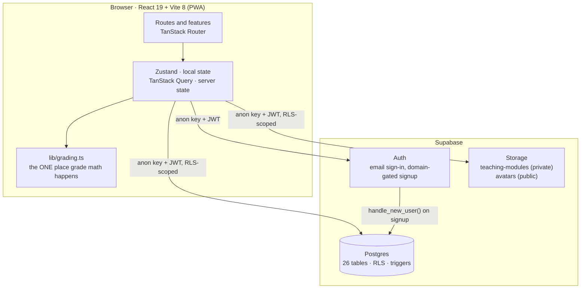

# Agilearn Documentation

[](https://github.com/azialah/agilearn/actions/workflows/ci.yml)
[](../package.json)
[](DATABASE.md)

Agilearn is a school-management platform for teachers and administrators —
classrooms, rosters, weighted gradebooks, attendance, and a shared teaching-modules
library, in one Vite + React SPA backed directly by Supabase. There is no
application server of its own: **Postgres Row Level Security is the access-control
boundary.**

This folder is the engineering documentation, separate from the top-level
[`README.md`](../README.md) (feature overview and quickstart). For the agent-facing
operating rules — ownership zones, execution limits, house conventions — read
[`.claude/CLAUDE.md`](../.claude/CLAUDE.md) instead; it and
[`CONTRIBUTING.md`](../CONTRIBUTING.md) are the authority wherever this index and
the code disagree.

**Last updated:** August 31, 2026

---

## Architecture

Two layers, with a hard rule at the boundary: the browser never holds a secret, and
the database is the single source of truth. There is a deliberate absence of a
third layer — **no application server, no Edge Functions** — RLS carries the whole
access-control burden itself ([`.claude/CLAUDE.md` decision log](../.claude/CLAUDE.md)).



| Layer                                 | Owns                                                                          | Never does                                                                    |
| -------------------------------------- | -------------------------------------------------------------------------------- | ---------------------------------------------------------------------------------- |
| **Frontend** (`src/`)                 | UI, routing, TanStack Query hooks, Zustand local state, grade math                | Holding a `service_role` key, or any authorization decision RLS doesn't also enforce |
| **Supabase** (Auth + Postgres + Storage) | Source of truth, RLS enforcement, triggers, the domain-gated signup rule, Storage quota | Rendering HTML, or business logic that isn't expressible as RLS or a trigger — there's no Edge Function layer to escalate to |

### Stack at a glance

| Area                 | Choice                                                                    |
| ---------------------- | ------------------------------------------------------------------------ |
| UI                    | React 19.2, TypeScript 7 (strict, `tsc -b`), Vite 8.1, TanStack Router 1.170 |
| State                 | Zustand 5 (local) · TanStack Query 5 (server state)                       |
| Tables                | TanStack Table 8 + TanStack Virtual 3 — virtualized gradebook and rosters |
| Styling               | Tailwind CSS 4 (CSS-first, no config file) + Radix UI + Motion            |
| Backend               | Supabase: Postgres (RLS) + Auth (email) + Storage (private + public buckets) |
| Import / export       | pdf-lib (PDF) + xlsx (Excel)                                              |
| Observability         | Bugsnag (errors + performance)                                            |
| Tests                 | Vitest 4 + Testing Library                                                |
| PWA                   | vite-plugin-pwa — service worker, offline shell, offline mutation queue   |
| Delivery              | Vercel (static SPA) · Supabase CLI (migrations, `gen types`)              |

**A write, traced end to end** — a teacher enters a score:

1. `GradeGrid` (a feature component) calls a `useMutation` from `lib/queries/grades.ts`.
2. The typed `supabase-js` client sends the write carrying the signed-in JWT.
3. Postgres evaluates RLS before the row is touched — the `scores` policy confirms
   the caller owns the student's classroom.
4. A `before` trigger (`enforce_score_within_activity_max`) rejects anything outside
   `[0, activity.max_score]`.
5. On success, the mutation invalidates the relevant `keys.*` — TanStack Query
   refetches, the grid re-renders.

No step touches an application server: everything from step 2 onward is the
database enforcing itself. Full breakdown: [ARCHITECTURE.md](ARCHITECTURE.md) ·
[DATABASE.md](DATABASE.md).

---

## What is built

A real gradebook and roster system, not a prototype shell.

| Surface      | Shipped today                                                                                                                             |
| -------------- | ---------------------------------------------------------------------------------------------------------------------------------------- |
| **Teacher**   | Classrooms and rosters (bulk import), weighted gradebook (periods → categories → activities → scores), attendance tracking, a shared teaching-modules library, per-classroom analytics, a calendar, a full-screen grade slideshow, Excel/PDF import-export |
| **Admin**     | User and role management, domain allowlist plus requests, school-wide analytics overview, an audit log                                     |
| **Platform**  | Installable PWA with an offline mutation queue, domain-gated self-serve teacher signup, dark-leaning responsive UI                          |

---

## Repository map

```text
src/            React app — routes, features, lib (queries + grading + supabase client), components, types
supabase/       Postgres migrations, checks/ (pre-flight scripts for destructive migrations), seed.sql
public/         PWA assets, manifest, icons
scripts/        gen-icons.mjs — icon generation for the PWA manifest
docs/           This documentation set
dev-updates/    Dated development log entries
```

`.docs/` (hidden, repo root) holds dated reasoning records — the *why* behind a
session's fixes, not a changelog — internal working notes, not part of this index.

---

## Where to start

| I need to…                               | Read                                                        |
| ------------------------------------------ | ------------------------------------------------------------ |
| Get oriented in the source tree            | [`../README.md`](../README.md) · [`../CONTRIBUTING.md`](../CONTRIBUTING.md) |
| Understand the whole system                | [ARCHITECTURE.md](ARCHITECTURE.md)                            |
| Add a table, an RLS policy, or a trigger   | [DATABASE.md](DATABASE.md)                                    |
| Provision a new environment or deploy      | [DEPLOYMENT.md](DEPLOYMENT.md)                                 |
| Check the roadmap or a milestone's scope   | [BACKLOG.md](BACKLOG.md)                                       |
| Work on mobile/responsive behavior         | [MOBILE.md](MOBILE.md)                                         |
| Touch email notifications                  | [EMAIL_DELIVERY_ROADMAP.md](EMAIL_DELIVERY_ROADMAP.md)         |
| Touch Storage quotas or admin handoff      | [STORAGE_QUOTA_ADMIN_HANDOFF.md](STORAGE_QUOTA_ADMIN_HANDOFF.md) |
| See what a past session audited and found  | [audits/](audits/)                                              |

There is no `security/`, `operations/`, or `performance/` category folder — every
doc above still fits at the top level of `docs/`, and splitting into subfolders now
would mean rewriting every link into these files from `README.md`, `CLAUDE.md`, and
`CONTRIBUTING.md` for no real gain yet. Introduce a subfolder the day a category
actually accumulates more than one or two files.

---

## Documentation index

| File                                                             | Purpose                                                                    |
| ------------------------------------------------------------------ | ----------------------------------------------------------------------------- |
| [ARCHITECTURE.md](ARCHITECTURE.md)                                 | System shape, layer boundaries, feature map, auth & roles, storage           |
| [DATABASE.md](DATABASE.md)                                         | Every table, RLS policy, trigger, and view — plain-English, not SQL          |
| [DEPLOYMENT.md](DEPLOYMENT.md)                                     | Supabase provisioning, schema application, first-admin setup, Vercel deploy  |
| [BACKLOG.md](BACKLOG.md)                                           | Three-milestone roadmap with acceptance criteria and implementation context  |
| [EMAIL_DELIVERY_ROADMAP.md](EMAIL_DELIVERY_ROADMAP.md)             | Email notification system design                                             |
| [MOBILE.md](MOBILE.md)                                             | Mobile-first design and responsive behavior                                  |
| [STORAGE_QUOTA_ADMIN_HANDOFF.md](STORAGE_QUOTA_ADMIN_HANDOFF.md)   | Supabase storage quotas and admin responsibilities                           |
| [audits/](audits/)                                                 | Dated session audits (`TEMPLATE.md` is the format for a new one)             |

---

## Quality gates

Run in this order — matches [`.github/workflows/ci.yml`](../.github/workflows/ci.yml):

```bash
pnpm run format:check   # prettier --check . — the only lint gate, no ESLint
pnpm run typecheck      # tsc -b --noEmit
pnpm run test           # vitest run
pnpm run build          # tsc -b && vite build
```

All four must pass before a PR — see [`.claude/CLAUDE.md` §5](../.claude/CLAUDE.md).
A green `build` alone is not enough: formatting drift and type errors both fail CI
independently of it.

Schema work adds one habit, not a script: after any `supabase/migrations/*` change,
regenerate types and update [DATABASE.md](DATABASE.md) in the same PR —

```bash
supabase gen types typescript --local > src/lib/database.types.ts
```

---

## Deployment

**Frontend:** Vercel (static SPA, `vercel.json` SPA rewrite). **Backend:** Supabase
(Postgres + Auth + Storage) — migrations and Storage buckets are managed separately
via the Supabase CLI/dashboard, never bundled into the frontend deploy.

Full walkthrough: [DEPLOYMENT.md](DEPLOYMENT.md).

---

## Security boundaries

- **RLS is the only authorization layer.** There is no application server and no
  `service_role` key anywhere in this codebase — if one ever appears in `src/`,
  that's a critical leak. See [DATABASE.md](DATABASE.md) for every policy.
- `VITE_SUPABASE_URL` and `VITE_SUPABASE_ANON_KEY` are the only environment
  variables, and both are meant to be public — they're inlined into the browser
  bundle. The security model relies on RLS, not on keeping the anon key secret.
- Teacher self-signup is domain-gated (`allowed_email_domains`, enforced by
  `handle_new_user()`); there is one self-retiring bootstrap-admin exemption — see
  the "Access-control helper functions" section of [DATABASE.md](DATABASE.md).
- A new table without RLS enabled and at least one policy is a critical gap —
  verify with `/rls-audit` before committing a migration.
- The private `teaching-modules` bucket must never become public or serve
  long-lived public URLs.
